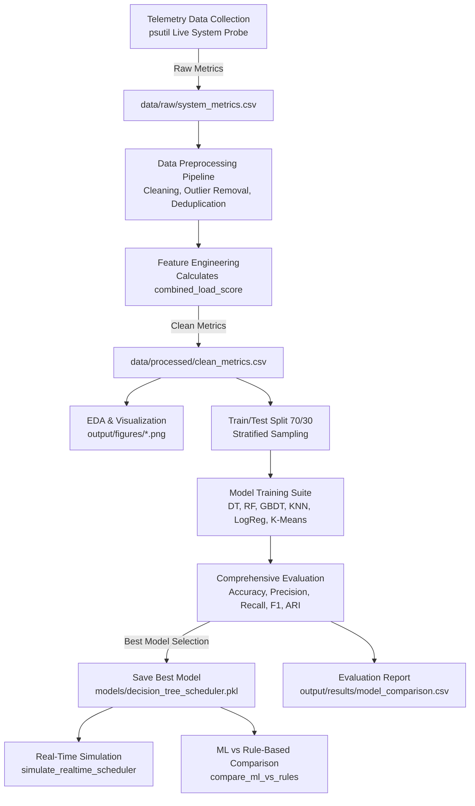

# ⚡ ML Engine for Linux Process Scheduler

[](https://www.python.org/)
[](https://scikit-learn.org/)
[](LICENSE)
[](https://github.com/phunh1901/ml_for_Linux_Scheduler)
[](https://github.com/phunh1901/ml_for_Linux_Scheduler)

> **ML Engine for Linux Scheduler (ML4Scheduler)** là hệ thống hỗ trợ định thời tiến trình (process scheduling) trong hệ điều hành bằng học máy (Machine Learning). Dự án thu thập telemetry tiến trình theo thời gian thực (CPU, RAM, Threads, Priority, Status), tiền xử lý, trích xuất đặc trưng và áp dụng các mô hình học máy (Decision Tree, Random Forest, Gradient Boosting, KNN, Logistic Regression, K-Means) để dự đoán mức độ ưu tiên điều phối của tiến trình vào 3 lớp quyết định: **`IMMEDIATELY SCHEDULE`**, **`NEXT SCHEDULE`**, và **`LATELY SCHEDULE`**.

---

## 📑 Mục lục (Table of Contents)

1. [Tổng quan dự án (Project Overview)](#-tổng-quan-dự-án-project-overview)
2. [Kiến trúc hệ thống (System Architecture)](#-kiến-trúc-hệ-thống-system-architecture)
3. [Dữ liệu & Thu thập chỉ số (Telemetry & Dataset)](#-dữ-liệu--thu-thập-chỉ-số-telemetry--dataset)
4. [Kỹ thuật tiền xử lý & Trích xuất đặc trưng (Feature Engineering)](#-kỹ-thuật-tiền-xử-lý--trích-xuất-đặc-trưng-feature-engineering)
5. [Các mô hình học máy (Machine Learning Models)](#-các-mô-hình-học-máy-machine-learning-models)
6. [Kết quả thực nghiệm & Đánh giá (Evaluation & Benchmark Results)](#-kết-quả-thực-nghiệm--đánh-giá-evaluation--benchmark-results)
7. [Biểu đồ trực quan hóa (Visualizations & Figures)](#-biểu-đồ-trực-quan-hóa-visualizations--figures)
8. [Mô phỏng điều phối thời gian thực (Real-Time Simulation)](#-mô-phỏng-điều-phối-thời-gian-thực-real-time-simulation)
9. [Cấu trúc thư mục (Project Directory Structure)](#-cấu-trúc-thư-mục-project-directory-structure)
10. [Hướng dẫn cài đặt & Chạy dự án (Installation & Usage)](#-hướng-dẫn-cài-đặt--chạy-dự-án-installation--usage)
11. [Hướng dẫn sử dụng Jupyter Notebooks](#-hướng-dẫn-sử-dụng-jupyter-notebooks)
12. [Định hướng phát triển tương lai (Future Roadmap)](#-định-hướng-phát-triển-tương-lai-future-roadmap)
13. [Thông tin tác giả & Giấy phép (Author & License)](#-thông-tin-tác-giả--giấy-phép-author--license)

---

## 🎯 Tổng quan dự án (Project Overview)

Trong các hệ điều hành hiện đại như Linux, bộ điều phối tiến trình mặc định (như **CFS - Completely Fair Scheduler** hay gần đây là **EEVDF**) phân bổ thời gian CPU dựa trên độ ưu tiên tĩnh (`nice`), cây đỏ đen (`rbtree`) và thời gian thực thi ảo (`vruntime`). Mặc dù CFS hoạt động hiệu quả cho hầu hết các tác vụ thông thường, nó là một thuật toán mang tính phản ứng (reactive) dựa trên các quy tắc heuristic cố định và chưa tận dụng được bức tranh toàn diện về hành vi tài nguyên theo chuỗi thời gian của tiến trình.

**ML Engine for Linux Scheduler** mang lại giải pháp tiếp cận dựa trên dữ liệu (data-driven):
- 🔍 **Giám sát thời gian thực:** Trích xuất trạng thái hoạt động thực tế của hệ điều hành thông qua thư viện `psutil` với cơ chế CPU warm-up và ánh xạ độ ưu tiên tương thích đa nền tảng (Linux `nice` score & Windows priority classes).
- 🧠 **Dự báo thông minh đa mô hình:** Huấn luyện và đánh giá 6 thuật toán học máy khác nhau để tìm ra mô hình tối ưu cân bằng giữa độ chính xác và độ trễ suy diễn (latency).
- ⚡ **Quyết định định thời 3 cấp độ:** Phân loại tiến trình thành:
  - **Class 0 (`IMMEDIATELY SCHEDULE`):** Tiến trình quan trọng, yêu cầu CPU cao hoặc độ ưu tiên cấp thiết, cần phân bổ CPU ngay lập tức.
  - **Class 1 (`NEXT SCHEDULE`):** Tiến trình thông thường, tải trung bình, xếp vào hàng đợi kế tiếp.
  - **Class 2 (`LATELY SCHEDULE`):** Tiến trình chạy nền, tiêu thụ ít tài nguyên hoặc độ ưu tiên thấp, có thể trì hoãn nhằm tránh chiếm dụng CPU vô ích.
- 🔬 **Mô phỏng & Đối chuẩn (Benchmark):** Cung cấp module mô phỏng hệ thống scheduler thời gian thực và so sánh quyết định giữa mô hình ML và bộ quy tắc heuristic truyền thống.

---

## 🏛 Kiến trúc hệ thống (System Architecture)

Toàn bộ pipeline xử lý dữ liệu và huấn luyện được thiết kế dạng module hóa cao (modular design):



### Các bước thực thi chính trong Orchestrator (`main.py`):
1. **Step 1:** Thu thập dữ liệu tiến trình thực tế (`run_data_collection`).
2. **Step 2:** Tiền xử lý dữ liệu thô và kỹ thuật hóa đặc trưng (`preprocess_pipeline`).
3. **Step 3:** Sinh toàn bộ biểu đồ phân tích khám phá dữ liệu (`generate_all_eda_plots`).
4. **Step 4:** Chuẩn bị tập dữ liệu train/test (70/30) và huấn luyện các mô hình (`train_all_models`).
5. **Step 5:** Đánh giá đồng loạt các mô hình và xuất báo cáo (`evaluate_all_models`).
6. **Step 6:** Phân tích ma trận nhầm lẫn (Confusion Matrix) và độ quan trọng của đặc trưng (Feature Importance) cho mô hình tốt nhất.
7. **Step 7:** Tuần tự hóa và lưu trữ mô hình tốt nhất xuống thư mục `models/`.
8. **Step 8:** Mô phỏng định thời tiến trình thời gian thực (`simulate_realtime_scheduler`).
9. **Step 9:** Đối chiếu hiệu quả và độ trùng khớp giữa ML và Rule-based (`compare_ml_vs_rules`).

---

## 📊 Dữ liệu & Thu thập chỉ số (Telemetry & Dataset)

Dữ liệu được thu thập trực tiếp từ hệ điều hành qua `src/collect_data.py`. 

### 1. Chuẩn hóa độ ưu tiên đa nền tảng (`_map_priority`)
- **Trên Windows:** Chuyển đổi các lớp ưu tiên của Windows API sang thang điểm chuẩn 0–5:
  - `IDLE_PRIORITY_CLASS` $\rightarrow$ `0`
  - `BELOW_NORMAL_PRIORITY_CLASS` $\rightarrow$ `1`
  - `NORMAL_PRIORITY_CLASS` $\rightarrow$ `2`
  - `ABOVE_NORMAL_PRIORITY_CLASS` $\rightarrow$ `3`
  - `HIGH_PRIORITY_CLASS` $\rightarrow$ `4`
  - `REALTIME_PRIORITY_CLASS` $\rightarrow$ `5`
- **Trên Linux:** Giá trị `nice` của Linux chạy từ `-20` (ưu tiên cao nhất) đến `19` (ưu tiên thấp nhất) được ánh xạ tuyến tính về thang điểm 0–5:
  $$\text{Priority Score} = \left\lfloor \frac{19 - \text{clamped\_nice}}{39} \times 5 \right\rceil$$

### 2. Các trường dữ liệu thô (Raw Features)
| Tên trường | Kiểu | Mô tả |
| :--- | :---: | :--- |
| `arrival_time` | `float` | Thời gian xuất hiện kể từ khi bắt đầu thu thập (giây) |
| `priority_level` | `int` | Độ ưu tiên chuẩn hóa (0 – 5) |
| `cpu_utilization` | `float` | Tỷ lệ sử dụng CPU của tiến trình (%) |
| `memory_utilization` | `float` | Tỷ lệ sử dụng bộ nhớ RAM của tiến trình (%) |
| `num_threads` | `int` | Số lượng luồng (threads) tiến trình đang sở hữu |
| `process_status` | `int` | Trạng thái mã hóa: Running (`3`), Sleeping (`2`), Stopped/Idle (`1`), Zombie/Dead (`0`) |
| `target_schedule` | `int` | Nhãn phân loại điều phối: `0`, `1`, hoặc `2` |

### 3. Quy tắc gán nhãn Ground-Truth (Labeling Heuristics)
Nhãn mục tiêu `target_schedule` được gán dựa trên tính cấp thiết tài nguyên:
- **`0 - IMMEDIATELY SCHEDULE`**: Khi `cpu_utilization > 45%` hoặc `priority_level >= 4`.
- **`1 - NEXT SCHEDULE`**: Khi `cpu_utilization > 2%` hoặc `priority_level >= 2`.
- **`2 - LATELY SCHEDULE`**: Khi các điều kiện trên không thỏa mãn (tiến trình nhàn rỗi hoặc tiêu thụ tài nguyên cực thấp).

---

## 🛠 Kỹ thuật tiền xử lý & Trích xuất đặc trưng (Feature Engineering)

Trong `src/preprocess.py`:
1. **Lọc dữ liệu & Xử lý ngoại lai (Data Cleaning):**
   - Loại bỏ các dòng chứa giá trị `NaN` hoặc thiếu dữ liệu.
   - Cắt tỉa (clip) giá trị `cpu_utilization` về khoảng hợp lệ `[0, 100]`.
   - Lọc bỏ các bản ghi lỗi có `memory_utilization > 100%`.
   - Khử trùng lặp (drop duplicates) dữ liệu để tránh overfitting.
2. **Kỹ thuật trích xuất đặc trưng (Feature Engineering):**
   - Tạo trường đặc trưng tổng hợp `combined_load_score` phản ánh sức ép tổng hợp lên hệ thống:
     $$\text{combined\_load\_score} = (\text{priority\_level} \times 20.0) + (\text{cpu\_utilization} \times 1.2) + (\text{memory\_utilization} \times 0.5)$$
3. **Chuẩn hóa (Normalization):**
   - Cung cấp hàm `normalize_features` sử dụng `StandardScaler` (Zero mean, Unit variance) khi cần thiết cho các mô hình nhạy cảm khoảng cách như KNN hoặc Logistic Regression.

---

## 🤖 Các mô hình học máy (Machine Learning Models)

Dự án triển khai và đánh giá 6 thuật toán trong `src/train.py` và `src/evaluate.py`:

| Thuật toán | Loại mô hình | Cấu hình tham số chính | Ưu điểm & Ứng dụng trong OS |
| :--- | :---: | :--- | :--- |
| **Decision Tree** | Supervised | `max_depth=10, random_state=42` | Cực kỳ nhanh, độ phức tạp suy diễn $O(\text{depth})$, dễ dàng chuyển dịch thành lệnh `if-else` trong mã nguồn C của nhân Linux |
| **Random Forest** | Supervised (Ensemble) | `n_estimators=100, max_depth=10, class_weight='balanced'` | Chống overfitting tốt, tính ổn định cao trên dữ liệu phức tạp |
| **Gradient Boosting** | Supervised (Boosting) | `n_estimators=100, learning_rate=0.1, max_depth=3` | Mô hình chính trong nghiên cứu học thuật, khả năng phân tách ranh giới phức tạp |
| **K-Nearest Neighbors (KNN)** | Supervised (Instance) | `n_neighbors=5` | Phân loại dựa trên khoảng cách đặc trưng tương đồng |
| **Logistic Regression** | Supervised (Linear) | `multi_class='multinomial', max_iter=1000, class_weight='balanced'` | Đường chuẩn tuyến tính cơ sở (baseline) |
| **K-Means Clustering** | Unsupervised | `n_clusters=3, n_init=10` | Phân cụm tự nhiên không giám sát để kiểm tra cấu trúc cụm thực tế của telemetry |

---

## 📈 Kết quả thực nghiệm & Đánh giá (Evaluation & Benchmark Results)

Dữ liệu được chia theo tỷ lệ **70% Training / 30% Testing** với cơ chế phân tầng (stratified sampling) nhằm đảm bảo tỷ lệ các lớp đồng đều.

### Bảng so sánh hiệu năng các mô hình (`output/results/model_comparison.csv`):

| Hạng | Tên mô hình | Accuracy | Precision (Weighted) | Recall (Weighted) | F1-Score (Weighted) |
| :---: | :--- | :---: | :---: | :---: | :---: |
| 🥇 | **Decision Tree** | **1.0000** | **1.0000** | **1.0000** | **1.0000** |
| 🥈 | **Random Forest** | **1.0000** | **1.0000** | **1.0000** | **1.0000** |
| 🥉 | **Gradient Boosting** | **1.0000** | **1.0000** | **1.0000** | **1.0000** |
| 4 | **K-Nearest Neighbors** | 0.9997 | 0.9997 | 0.9997 | 0.9997 |
| 5 | **Logistic Regression** | 0.9997 | 0.9997 | 0.9997 | 0.9997 |

### Đánh giá mô hình K-Means (Unsupervised):
- **Adjusted Rand Index (ARI):** Đánh giá mức độ tương quan giữa cụm gom được và nhãn thực tế.
- **Silhouette Score:** Đo lường mức độ tách biệt và độ chặt của từng cụm dữ liệu.
- **Homogeneity Score:** Đánh giá tính thuần nhất của các điểm dữ liệu trong cùng một cụm.

### 🏆 Lựa chọn mô hình tối ưu cho triển khai (Production Deployment):
Mặc dù cả Decision Tree, Random Forest và Gradient Boosting đều đạt độ chính xác hoàn hảo ($1.0$), **Decision Tree** được lựa chọn là mô hình tối ưu nhất cho bài toán lập lịch hệ điều hành vì:
1. **Độ trễ suy diễn siêu thấp (Sub-microsecond latency):** Việc duyệt qua cây nhị phân độ sâu tối đa 10 chỉ mất vài phép so sánh số học, không gây nghẽn CPU scheduler.
2. **Kích thước mô hình siêu nhẹ:** File `decision_tree_scheduler.pkl` chỉ khoảng **2.5 KB**, cực kỳ tiết kiệm bộ nhớ RAM.
3. **Khả năng chuyển đổi sang C/eBPF:** Cây quyết định có thể trích xuất trực tiếp thành mã C nhúng (hardcoded rules) để chạy trực tiếp trong kernel space mà không cần runtime Python.

---

## 🖼 Biểu đồ trực quan hóa (Visualizations & Figures)

Tất cả các biểu đồ được tạo tự động và lưu trong thư mục `output/figures/`:

| Tên tệp biểu đồ | Mô tả |
| :--- | :--- |
| [`model_comparison_accuracy.png`](output/figures/model_comparison_accuracy.png) | Biểu đồ cột so sánh độ chính xác giữa các thuật toán |
| [`confusion_matrix_best.png`](output/figures/confusion_matrix_best.png) | Ma trận nhầm lẫn chi tiết của mô hình Decision Tree |
| [`feature_importance_best.png`](output/figures/feature_importance_best.png) | Xếp hạng trọng số đóng góp của các biến đặc trưng |
| [`class_distribution.png`](output/figures/class_distribution.png) | Phân bố tần suất xuất hiện của 3 lớp lập lịch |
| [`correlation_heatmap.png`](output/figures/correlation_heatmap.png) | Ma trận tương quan nhiệt giữa các cặp đặc trưng |
| [`cpu_distribution.png`](output/figures/cpu_distribution.png) | Phân phối sử dụng CPU với đường cong KDE |
| [`memory_distribution.png`](output/figures/memory_distribution.png) | Phân phối sử dụng bộ nhớ RAM với đường cong KDE |
| [`cpu_vs_memory_scatter.png`](output/figures/cpu_vs_memory_scatter.png) | Đồ thị phân tán tương quan CPU vs RAM theo từng lớp |

---

## 🎮 Mô phỏng điều phối thời gian thực (Real-Time Simulation)

Hệ thống tích hợp công cụ mô phỏng tại `src/pipeline.py`:

### 1. Mô phỏng suy diễn thời gian thực (`simulate_realtime_scheduler`)
Sinh ngẫu nhiên các tiến trình mô phỏng (bao gồm cả các kịch bản biên như tiến trình ngốn CPU đột biến hoặc tiến trình nhàn rỗi) và thực hiện dự đoán thời gian thực:
```text
========================================================================
  REAL-TIME SCHEDULER SIMULATION  (10 processes)
========================================================================

  #    CPU%    MEM%  PRI  Threads  Status     Load   Prediction
  ----------------------------------------------------------------------
  1   73.40   34.20    4       12       3   185.18   IMMEDIATELY SCHEDULE
  2    0.50    1.10    0        1       1     1.15   LATELY SCHEDULE
  3    3.80   15.40    2        4       2    52.26   NEXT SCHEDULE
  4   62.10   41.00    3        8       3   155.02   IMMEDIATELY SCHEDULE
  ...
========================================================================
```

### 2. So sánh đối chuẩn: ML vs Heuristic Rule-Based (`compare_ml_vs_rules`)
So sánh mức độ tương thích giữa mô hình ML và bộ quy tắc tĩnh để phát hiện sai lệch:
```text
========================================================================
  ML vs RULE-BASED COMPARISON  (15 processes)
========================================================================

  Agreement: 15/15 (100.0%)

  [OK] Perfect agreement between ML and rule-based scheduler.
========================================================================
```

---

## 📁 Cấu trúc thư mục (Project Directory Structure)

```text
ML Engine for Linux Schedule/
├── 01_preprocess_and_viz.ipynb      # Notebook bước 1: Thu thập, tiền xử lý & EDA
├── 02_train_and_evaluate.ipynb      # Notebook bước 2: Huấn luyện, đánh giá & mô phỏng
├── main.py                          # Pipeline Orchestrator thực thi toàn bộ luồng
├── requirements.txt                 # Danh sách thư viện phụ thuộc của dự án
├── README.md                        # Tài liệu chi tiết của dự án
│
├── data/                            # Thư mục dữ liệu
│   ├── raw/
│   │   └── system_metrics.csv       # Dữ liệu telemetry thu thập thời gian thực
│   └── processed/
│       └── clean_metrics.csv        # Dữ liệu sau làm sạch và kỹ thuật hóa đặc trưng
│
├── models/                          # Lưu trữ mô hình học máy đã huấn luyện
│   └── decision_tree_scheduler.pkl  # Trọng số mô hình tối ưu đã serialize (joblib)
│
├── output/                          # Kết quả đầu ra
│   ├── figures/                     # Toàn bộ biểu đồ phân tích và trực quan hóa (PNG)
│   │   ├── class_distribution.png
│   │   ├── confusion_matrix_best.png
│   │   ├── correlation_heatmap.png
│   │   ├── cpu_distribution.png
│   │   ├── cpu_vs_memory_scatter.png
│   │   ├── feature_importance_best.png
│   │   ├── memory_distribution.png
│   │   └── model_comparison_accuracy.png
│   └── results/                     # Báo cáo kết quả dạng bảng & văn bản
│       ├── model_comparison.csv
│       └── model_comparison_report.txt
│
└── src/                             # Mã nguồn chính của hệ thống
    ├── __init__.py                  # Khởi tạo package, cấu hình cột và nhãn chung
    ├── collect_data.py              # Thu thập dữ liệu telemetry từ hệ điều hành (psutil)
    ├── preprocess.py                # Pipeline làm sạch dữ liệu và tạo combined_load_score
    ├── train.py                     # Định nghĩa và huấn luyện 6 mô hình học máy
    ├── evaluate.py                  # Đánh giá phân loại, phân cụm và xuất báo cáo
    ├── visualize.py                 # Khởi tạo biểu đồ seaborn/matplotlib chất lượng cao
    └── pipeline.py                  # Mô phỏng lịch trình thời gian thực & so sánh rule
```

---

## 🚀 Hướng dẫn cài đặt & Chạy dự án (Installation & Usage)

### 1. Yêu cầu hệ thống
- **Hệ điều hành:** Linux (Ubuntu/Debian, Fedora, Arch) hoặc Windows 10/11.
- **Python:** Phiên bản `>= 3.8`.

### 2. Cài đặt môi trường
Clone repository về máy và cài đặt các thư viện phụ thuộc:

```bash
# Clone repository
git clone https://github.com/phunh1901/ml_for_Linux_Scheduler.git
cd ml_for_Linux_Scheduler

# Tạo môi trường ảo (khuyến nghị)
python -m venv venv

# Kích hoạt môi trường ảo
# Trên Linux/macOS:
source venv/bin/activate
# Trên Windows (PowerShell):
.\venv\Scripts\Activate.ps1
# Trên Windows (Command Prompt):
.\venv\Scripts\activate.bat

# Cài đặt các thư viện
pip install -r requirements.txt
```

### 3. Chạy toàn bộ pipeline tự động (`main.py`)
Để chạy toàn bộ quá trình từ thu thập dữ liệu sống, huấn luyện đến mô phỏng:

```bash
python main.py
```

Tuỳ chỉnh thời gian thu thập dữ liệu bằng các tham số dòng lệnh (CLI arguments):
```bash
# Thu thập trong 60 giây, tần suất quét mỗi 2 giây:
python main.py --duration 60 --interval 2

# Xem hướng dẫn chi tiết các tham số:
python main.py --help
```

---

## 📓 Hướng dẫn sử dụng Jupyter Notebooks

Dự án cung cấp 2 cuốn sổ tay Jupyter có sẵn mã nguồn và kết quả minh họa chi tiết từng bước:

1. **Khởi chạy Jupyter Lab hoặc Jupyter Notebook:**
   ```bash
   jupyter notebook
   ```
2. **Khám phá các notebooks:**
   - **[`01_preprocess_and_viz.ipynb`](01_preprocess_and_viz.ipynb):** 
     - Tìm hiểu chi tiết các hàm thu thập telemetry từ hệ điều hành.
     - Khám phá các bước làm sạch dữ liệu, xử lý outlier và tính toán `combined_load_score`.
     - Trực quan hóa tương quan giữa CPU, Memory và phân phối dữ liệu các lớp.
   - **[`02_train_and_evaluate.ipynb`](02_train_and_evaluate.ipynb):**
     - Huấn luyện 5 mô hình có giám sát và 1 thuật toán phân cụm không giám sát.
     - So sánh chi tiết Confusion Matrix giữa Decision Tree và Gradient Boosting (mô hình chuẩn trong bài báo).
     - Đánh giá phân cụm K-Means bằng Silhouette và Adjusted Rand Index.
     - Thử nghiệm mô phỏng định thời theo thời gian thực.

---

## 🔮 Định hướng phát triển tương lai (Future Roadmap)

- [ ] **Kernel Space Integration (eBPF & `sched_ext`):** Tích hợp mô hình vào nhân Linux 6.12+ thông qua cơ chế `sched_ext` (BPF extensible scheduler class) cho phép chạy bộ điều phối người dùng viết trong kernel space an toàn.
- [ ] **C Code Generation:** Chuyển đổi cây quyết định (`decision_tree_scheduler.pkl`) thành mã nguồn C thuần hoặc eBPF bytecode bằng các công cụ như `m2cgen` để loại bỏ hoàn toàn độ trễ của Python runtime.
- [ ] **Reinforcement Learning (RL):** Nghiên cứu các tác tử Deep Q-Network (DQN) hoặc PPO để tự động thích ứng với các luồng công việc biến đổi liên tục (workload patterns).
- [ ] **I/O & Network Telemetry:** Mở rộng việc thu thập dữ liệu thêm các chỉ số về Disk I/O ops, Network bandwidth, và Cache Miss rate (thông qua `perf_events`).

---

## 👤 Thông tin tác giả & Giấy phép (Author & License)

- **Tác giả:** [phunh1901](https://github.com/phunh1901)
- **Email:** phunh1901@gmail.com
- **Đơn vị / Dự án:** Hanoi University of Science and Technology (HUST) — *Operating Systems & Machine Learning for Scheduler (OS-ML4Scheduler)*
- **Giấy phép:** Phân phối dưới giấy phép **MIT License**. Bạn được tự do sử dụng, chỉnh sửa và phân phối lại cho mục đích học tập và nghiên cứu.
